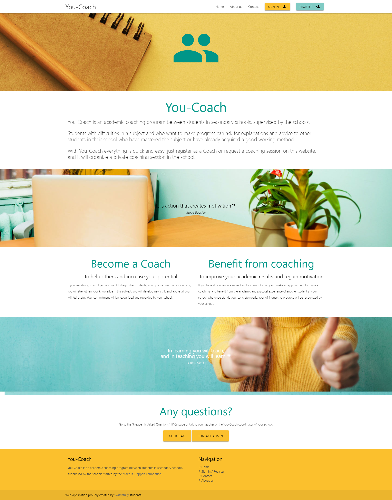
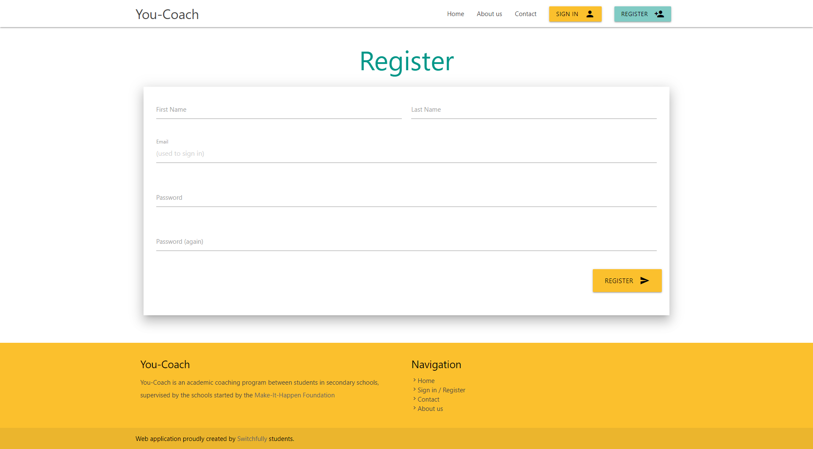

### Story 1: Register
**As a user I want to register myself to have access to You-coach.**

- Register screen (register.title)
    - First Name (register.label.first-name)
    - Last Name (register.label.last-name)
    - Email (used to sign in) (register.label.string)
    - Password  (register.label.string)
    - Password  (register.label.string)
   
    - Validation
        - string is a valid string format (register.message.string-wrong-format)
            - internal format validation, no external webservice
        - string is not yet used within the system (register.message.string-in-use)
        - password validation (register.message.password-policy, register.message.password-match)
          
- in scope
    - Creation of the homepage 
    - Creation of the register screen
    - redirect to empty profile page upon success 
    
- Open Questions
    - Password policy?
            - min 8 characters
            - min one number
            - min one capital

- mockups
    - 
              
    - 
   
