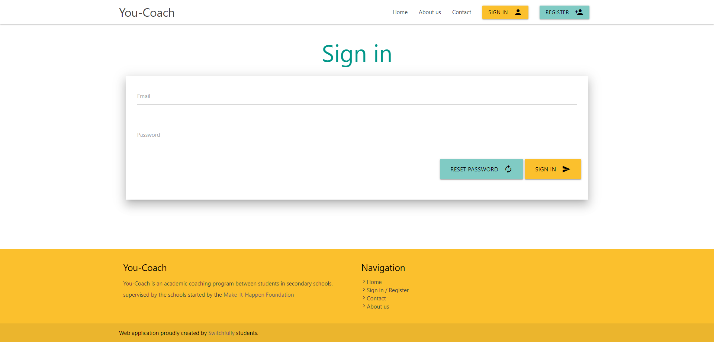

### Story 2: Sign in
**As a user I want to sign in to have access to You-coach**

- sign-in screen (sign-in.title)
    - string (sign-in.label.string)
    - Password (<input type='password'/>) (sign-in.label.password)
    
    - Validation
        - string is not known in the system (sign-in.message.string-unknown)
        - combination of string and password is not valid (sign-in.message.login-failed)
    
- in scope
    - Creation of the sign in screen
        - reset password button (not yet implemented --> alert: contact admin)
    - redirect to empty profile page upon success
    - redirect to home page after sign-out
       
- Open Questions
    - How will a password reset happen before story 31 is implemented?
        - test manual encryption of password (bkrypt)

- mockups
    - 
